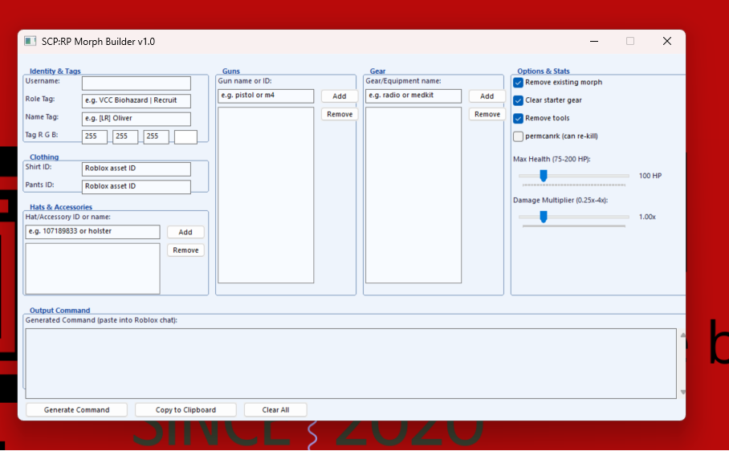

# SCP:RP Morph Builder V1

First stable release of the **SCP:RP Morph Builder** — a lightweight Windows GUI tool for generating Roblox SCP:RP admin commands.

---

## 🚀 What it does

Builds complex `/run` command strings for SCP:RP morph setup by combining multiple admin commands into a single pasteable line.

No more typing long commands manually in Roblox chat.

---

## ✨ Features

### 🧑 Identity & Tags
- Username
- Role tag
- Name tag
- Custom RGB tag colors with live preview

### 👕 Clothing
- Shirt asset ID support
- Pants asset ID support

### 🎩 Hats & Accessories
- Add/remove multiple hats by ID or name

### 🔫 Guns
- Starter weapon loadout builder

### 🧰 Gear
- Radios, medkits, and equipment support

### ⚙️ Options & Stats
- Remove existing morph
- Clear starter gear
- Remove tools
- `permcanrk` (re-kill permission)
- Max health slider (75–200 HP)
- Damage multiplier slider (0.25x–4x)

---

## ⚡ Features Overview

- One-click command generation
- Full `/run` command builder using `&` chaining
- Copy to clipboard support
- Clear All reset button
- Live preview system for tags/colors

---

## 🖼 Screenshot

---

## 📦 Download

| File | Description |
|------|-------------|
| `https://github.com/trinibos1/Morphmaker/releases/tag/Stable` | Standalone Windows executable (no installer required) |

---

## 🖥 Requirements

- Windows 7 or later
- No dependencies (fully portable `.exe`)
---

## 🧭 Usage

1. Launch the app  
2. Enter target username  
3. Configure morph settings  
4. Click **Generate Command**  
5. Click **Copy to Clipboard**  
6. Paste into Roblox chat

---

## ⚠️ Notes

- Designed for SCP:RP 
- Requires server permission for `/run` execution
- Not affiliated with Roblox or SCP Foundation

---

## 📌 Version

**v1.0.0 — Stable Release**
