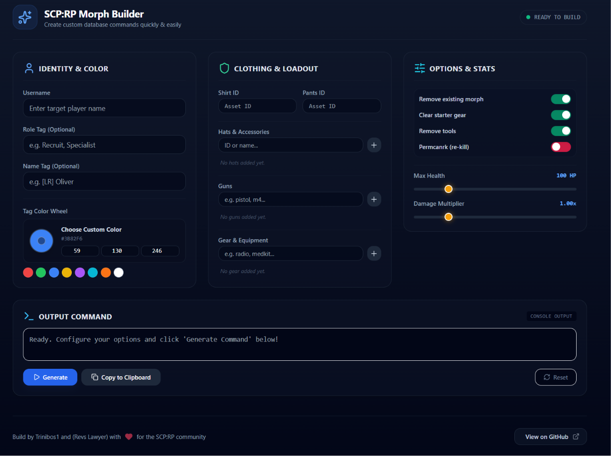

# SCP:RP Morph Builder V1

A lightweight utility for generating Roblox SCP:RP admin commands.  
Available as both a standalone portable Windows application and a fully responsive modern web app.

---

# 🚀 What it does

Builds complex `/run` command strings for SCP:RP morph setup by combining multiple admin commands into a single pasteable line using safe `&` chaining.

No more typing long commands manually in Roblox chat. Just configure your morph, click generate, and paste.

---

# ✨ Features

## 🧑 Identity & Tags

- Username input
- Role tag support
- Name tag support
- Custom RGB tag colors
- Live color preview system
- Quick preset colors for divisions and classic Roblox styles
- Visual color wheel support on the Web version

---

## 👕 Clothing & Loadout

- Shirt asset ID support
- Pants asset ID support
- Dynamic accessory management
- Scrollable tag feeds for equipment lists

---

## 🎩 Hats & Accessories

- Add/remove multiple hats
- Supports IDs or names
- Dynamic accessory tag system

---

## 🔫 Guns

- Starter weapon loadout builder
- Multiple weapon support

---

## 🧰 Gear

- Radios
- Medkits
- Utility equipment support

---

## ⚙️ Options & Stats

### Smart Toggle Options

- Remove existing morph
- Clear starter gear
- Remove tools
- `permcanrk` support
- Interactive ON/OFF switches

### Interactive Modifiers

- Max health slider (`75–200 HP`)
- Damage multiplier slider (`0.25x–4x`)
- Bright visual slider handles
- Real-time value updates

---

# ⚡ Features Overview

- One-click command generation
- Full `/run` command builder using `&` chaining
- Copy to clipboard support
- Quick reset / clear-all functionality
- Interactive toast notifications
- Responsive desktop/tablet/mobile layout
- Modern high-contrast UI
- Live preview system for tags and colors

---

# 🖼 Screenshots

## 🖥️ Web Version

## 💾 Windows Application

---

# 📦 Access & Downloads

| Platform | Type | Link |
|----------|------|------|
| Web App | Live Interactive Site | 👉 PLACEHOLDER_LINK 👈 |
| Windows Desktop | Standalone `.exe` | https://github.com/trinibos1/Morphmaker/releases/tag/Stable |

---

# 🖥 Requirements

## Web Version

- Chrome
- Firefox
- Edge
- Safari
- Desktop or Mobile browser

## Windows Desktop Version

- Windows 7 or later
- No dependencies
- Fully portable executable
- No installation required

---

# 🧭 Usage

1. Open the Web App or launch the Desktop App
2. Enter the target username
3. Configure morph settings
4. Customize clothing, gear, tags, and stats
5. Click **Generate Command**
6. Click **Copy to Clipboard**
7. Paste the generated command into Roblox chat

---

# ⚠️ Disclaimer

- Designed specifically for Roblox SCP:RP
- Requires server permission for `/run` execution
- Not affiliated with Roblox Corporation or the SCP Foundation
- Independent community-made utility

---

# 📌 Version

## v1.0.0 — Stable Multi-Platform Release

Built by **Trinibos1** and **Revs Lawyer** ❤️

Feel free to star, fork, and contribute on the official GitHub repository.

---

# 📬 Contact

### Discord
`trinibos1`

### Email
`Trinibos1@proton.me`
